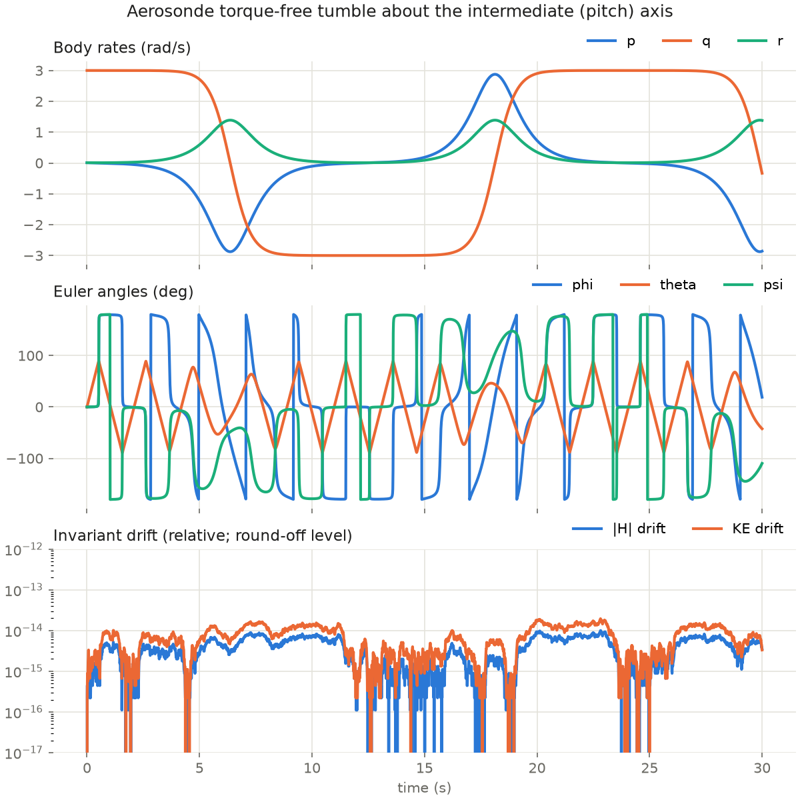

# bwb-uav-sim

Simulation-only blended-wing-body (BWB) UAV: aerodynamic design, a C++ 6-DOF flight simulator, and guidance, navigation and control, built as a GNC / aerospace engineering portfolio project.

The aircraft is a 1.8 m span, ~2.4 kg electric BWB with a low-observable-inspired planform, a rear folding pusher prop, elevons and twin canted fins, sized for ~2 h loiter as an EO/IR sensor platform. It has been designed and simulated, not built or flown.

## Status

| Phase | What | State |
|---|---|---|
| 1 | Requirements and sizing | done (brief Rev 0) |
| 2 | Aero design in flow5: airfoils, planform, fins, CG, stability and control derivatives | done (Rev 0.3–0.6) |
| — | Propulsion sizing (motor, prop, ESC, endurance) | done (Rev 0.7–0.8) |
| 3 | C++ 6-DOF sim: verify on the Aerosonde (Beard & McLain), then the BWB | **in progress**: rigid-body core verified |
| 4 | GNC: autopilot, EKF, path following | not started |
| 5 | JSBSim cross-check, ArduPilot SITL comparison, Monte Carlo | not started |

The design decisions and their numbers are tracked in [`docs/design_log.md`](docs/design_log.md).

## Build and test

Needs a C++17 compiler and CMake ≥ 3.16. No other dependencies.

```bash
cmake -S . -B build
cmake --build build
ctest --test-dir build --output-on-failure
```

Plot the torque-free tumble demo (Python 3 with numpy and matplotlib, see `analysis/requirements.txt`):

```bash
mkdir -p out && ./build/tumble > out/tumble.csv
python3 analysis/plot_tumble.py out/tumble.csv
```



## Layout

```
sim/include/bwb/   headers: math types, rigid-body EOM, RK4, mass properties
sim/src/           implementation
sim/apps/          small executables (demos, later the main sim)
sim/tests/         verification tests, run by CTest
analysis/          Python plotting and analysis
docs/              design log and derivation notes
```

## Conventions

- SI units throughout; angles in radians inside the code.
- Frames and notation follow Beard & McLain, *Small Unmanned Aircraft: Theory and Practice*: NED inertial frame, body axes x forward / y right / z down, state (pn, pe, pd, u, v, w, e0..e3, p, q, r).
- Every model gets a test against a case with a known answer before it is used.

## License

MIT, see [LICENSE](LICENSE).
